# 🛠️ StarSound Troubleshooting Guide

Welcome! This guide helps you diagnose and fix common issues. Use the flowcharts below to identify your problem, then follow the **Solutions** section.

---

## 🎯 Quick Problem Identifier

```mermaid
flowchart TD
    A["❌ Something's Wrong"] --> B{What's happening?}
    B -->|StarSound won't start| C["→ App Launch Issues"]
    B -->|Can't find Starbound| D["→ Path Detection Issues"]
    B -->|Audio files not loading| E["→ Audio File Issues"]
    B -->|Conversion fails| F["→ Audio Processing Issues"]
    B -->|Mod didn't generate| G["→ Mod Generation Issues"]
    B -->|Music not in game| H["→ In-Game Issues"]
    
    style C fill:#ff6b6b
    style D fill:#ff6b6b
    style E fill:#ff6b6b
    style F fill:#ff6b6b
    style G fill:#ff6b6b
    style H fill:#ff6b6b
```



---

## 📋 Issue Flowcharts & Solutions

### 1️⃣ App Launch Issues

```mermaid
flowchart TD
    A["StarSound won't start"] --> B{Error message?}
    B -->|Python not found| C["→ Check Python 3.10+"]
    B -->|Module not found| D["→ Dependencies missing"]
    B -->|Port already in use| E["→ Another instance running"]
    B -->|GUI crashes immediately| F["→ Graphics/Display issue"]
    B -->|No error, just fails| G["→ Check logs"]
    
    style C fill:#fff3cd
    style D fill:#fff3cd
    style E fill:#fff3cd
    style F fill:#fff3cd
    style G fill:#fff3cd
```



**Solutions:**

| Error | Fix |
|-------|-----|
| **"Python not found"** | Install Python 3.10+ from [python.org](https://www.python.org/). Verify: `python --version` |
| **"ModuleNotFoundError"** | Reinstall dependencies: `pip install -r requirements.txt` |
| **"Port already in use"** | Close existing StarSound instance or restart your terminal |
| **GUI crashes immediately** | Try in terminal to see error: `python pygui/starsound_gui.py` |
| **No error, just fails** | Check `AStarSoundlog_current.txt` in the StarSound folder |

---

### 2️⃣ Path Detection Issues

```mermaid
flowchart TD
    A["Can't find Starbound"] --> B{Which platform?}
    B -->|Windows| C{Registry working?}
    B -->|Linux/Steam Deck| D{Steam folder exists?}
    B -->|macOS| E{Steam path set?}
    
    C -->|Yes| F["Check alternate drives"]
    C -->|No| G["→ Manual folder selection"]
    
    D -->|Yes| H["Check Flatpak path"]
    D -->|No| I["→ Manual folder selection"]
    
    E -->|Yes| J["Check Library path"]
    E -->|No| K["→ Manual folder selection"]
    
    style G fill:#fff3cd
    style I fill:#fff3cd
    style K fill:#fff3cd
```



**Solutions:**

| Platform | Problem | Fix |
|----------|---------|-----|
| **Windows** | Starbound not detected | 1. Check all drives (C:, D:, E:, etc.) for `\Steam\steamapps\common\Starbound` <br> 2. Use Settings → Manual Starbound Path <br> 3. Verify registry: Run `regedit` → `HKEY_CURRENT_USER\Software\Valve\Steam` → check `SteamPath` |
| **Linux** | Starbound not detected | 1. Check `~/.steam/steam/steamapps/common/Starbound` <br> 2. If using Flatpak, check `~/.var/app/com.valvesoftware.Steam/.steam/steam/steamapps/common/Starbound` <br> 3. Use Settings → Manual Starbound Path |
| **Steam Deck** | Starbound not detected | 1. Starbound should be auto-detected <br> 2. If not, use Settings → Manual Starbound Path <br> 3. Try: `find ~/.var -name "Starbound" -type d` in terminal |
| **macOS** | Starbound not detected | 1. Check `~/Library/Application\ Support/Steam/steamapps/common/Starbound` <br> 2. Use Settings → Manual Starbound Path <br> 3. Verify Steam installation |

**To manually select folder:**
1. Click **Settings** in StarSound
2. Click **Browse** next to "Starbound Folder"
3. Navigate to your Starbound installation
4. Select the folder containing `assets/`, `mods/`, `win32/` or `win64/`

---

### 3️⃣ Audio File Issues

```mermaid
flowchart TD
    A["Audio files won't load"] --> B{What's the error?}
    B -->|File not found| C["Check file path"]
    B -->|Format not supported| D["Convert to supported format"]
    B -->|File size too large| E["→ File size limit"]
    B -->|Corrupted file| F["→ File corruption"]
    B -->|Permission denied| G["→ File permissions"]
    
    style C fill:#fff3cd
    style D fill:#fff3cd
    style E fill:#fff3cd
    style F fill:#fff3cd
    style G fill:#fff3cd
```



**Solutions:**

| Issue | Fix |
|-------|-----|
| **File not found** | 1. Verify file still exists <br> 2. Check file path has no special characters <br> 3. Try using absolute path (full path from drive root) |
| **Format not supported** | StarSound supports: **MP3, FLAC, WAV, OGG** <br> If using other format, convert via: [Audacity](https://www.audacityteam.org/) or [FFmpeg](https://ffmpeg.org/) |
| **File size >500MB** | ⚠️ Maximum supported: 500 MB <br> **Workaround:** Files >30 min auto-split into segments <br> For extremely large files, trim in Audacity first |
| **Corrupted audio file** | 1. Re-download the file <br> 2. Try converting in Audacity <br> 3. Verify file plays in media player |
| **Permission denied** | 1. Right-click file → Properties → Security <br> 2. Ensure your user has "Read" permission <br> 3. Try copying to Documents first |

---

### 4️⃣ Audio Processing Issues

```mermaid
flowchart TD
    A["Audio conversion fails"] --> B{FFmpeg status?}
    B -->|FFmpeg not found| C["→ Install FFmpeg"]
    B -->|Conversion runs but hangs| D["→ Check file size"]
    B -->|Output is silent| E["→ Audio settings"]
    B -->|Output is too short| F["→ Silence trimming issue"]
    B -->|Unexpected error| G["→ Check logs"]
    
    style C fill:#fff3cd
    style D fill:#fff3cd
    style E fill:#fff3cd
    style F fill:#fff3cd
    style G fill:#fff3cd
```



**Solutions:**

| Problem | Fix |
|---------|-----|
| **FFmpeg not found** | 1. StarSound includes FFmpeg (bundled) <br> 2. If still missing, install: [ffmpeg.org](https://ffmpeg.org/download.html) <br> 3. Verify: `ffmpeg -version` in terminal |
| **Conversion hangs or times out** | 1. Check file size (<500MB recommended) <br> 2. Try splitting file: Enable track splitting in Step 5 <br> 3. Restart StarSound and try again |
| **Output audio is silent** | 1. Check "Normalization" setting (should be ON) <br> 2. Lower bitrate might need normalization check <br> 3. Try no audio filters first (EQ, compression off) <br> 4. Check input file plays in media player |
| **Output is suspiciously short** | ⚠️ Message: "Output is shorter than input. Audio processing may have removed content." <br> **Fix:** Disable "Silence Trimming" if enabled <br> Check EQ/compression settings aren't too aggressive |
| **Unexpected FFmpeg error** | 1. Check `AStarSoundlog_current.txt` for details <br> 2. Try different bitrate (128k, 192k, 256k) <br> 3. Try file conversion in Audacity first <br> 4. Report error with log file link |

---

### 5️⃣ Track Splitting Issues


**Solutions:**

| Issue | Fix |
|-------|-----|
| **File >30 min not auto-detected** | 1. Open Step 5 (Configure Audio) <br> 2. Click "Enable Track Splitting" manually <br> 3. Set segment length (5-30 minutes) <br> 4. Preview before processing |
| **Split creates wrong number of segments** | 1. Duration detection might be inaccurate <br> 2. Manually set segment length in Step 5 <br> 3. Example: 35-min file + 15-min segments = 3 parts (15+15+5) |
| **Split process fails or hangs** | 1. Check file size (<500MB) <br> 2. Ensure temp folder has space (2x file size) <br> 3. Try smaller segment length (10 min instead of 30) <br> 4. Restart and try again |
| **Missing segments after split** | 1. Check StarSound folder → Backups folder exists <br> 2. Look in: `mod_saves/{ModName}/backups/converted/` <br> 3. Check for `segment_001.wav`, `segment_002.wav`, etc. |

---

### 6️⃣ Mod Generation Issues

```mermaid
flowchart TD
    A["Mod didn't generate"] --> B{Error in which step?}
    B -->|Step 3: Audio Config| C["Check audio settings"]
    B -->|Step 4: Biome Select| D["Select at least one biome"]
    B -->|Step 5: Split Preview| E["Accept or adjust splits"]
    B -->|Step 6: Review| F["Confirm patch data"]
    B -->|Export failed| G["→ See Export Issues"]
    B -->|Silent failure| H["→ Check logs"]
    
    style C fill:#fff3cd
    style D fill:#fff3cd
    style E fill:#fff3cd
    style F fill:#fff3cd
    style G fill:#fff3cd
    style H fill:#fff3cd
```



**Solutions:**

| Step | Problem | Fix |
|------|---------|-----|
| **Step 3 - Audio Config** | Settings rejected | 1. Ensure bitrate between 64-320 kbps <br> 2. Check EQ values are reasonable <br> 3. Try "Reset to Default" button |
| **Step 4 - Biome Selection** | No biomes available | 1. Click "Select All" to enable all biomes <br> 2. Or manually check biome categories <br> 3. Ensure at least one biome selected before continuing |
| **Step 5 - Split Preview** | Split detection failed | 1. Check file duration detected correctly <br> 2. Manually set segment length <br> 3. Click "Preview" again <br> 4. If still fails, disable splitting |
| **Step 6 - Review/Patch** | Patch looks wrong | 1. Check patch entries are correct <br> 2. Verify biome paths (e.g., `/musicTrack/forest/...`) <br> 3. Don't edit JSON directly unless you know JSON format <br> 4. Cancel and restart from Step 1 |

---

### 7️⃣ Export Issues

```mermaid
flowchart TD
    A["Export failed"] --> B{Which format?}
    B -->|Loose Files| C["Check folder permissions"]
    B -->|PAK File| D{Platform?}
    
    D -->|Windows| E["Check asset_packer.exe"]
    D -->|Linux/Mac| F["PAK export not available"]
    
    C --> G["→ See Export Folder Issues"]
    E --> H["→ See PAK Export Issues"]
    F --> I["Use Loose Files instead"]
    
    style G fill:#fff3cd
    style H fill:#fff3cd
    style I fill:#fff3cd
```



**Solutions:**

| Issue | Fix |
|-------|-----|
| **Loose Files Export** | **Permission denied:** <br> 1. Right-click `Starbound/mods/` folder → Properties → Security <br> 2. Ensure your user has "Modify" or "Write" permission <br> 3. Try exporting to Desktop first to test <br> **Folder already exists:** <br> 1. StarSound will overwrite existing mod (this is OK) <br> 2. To use different name, change mod name in Step 1 <br> **Disk space full:** <br> 1. Free up space in drive <br> 2. OGG files should be smaller than originals |
| **PAK File Export** | **Linux/macOS:** PAK export not available <br> → Use Loose Files instead <br> **Windows - asset_packer.exe not found:** <br> 1. Verify Starbound installation path is correct <br> 2. Check `{StarPath}/win32/asset_packer.exe` exists <br> 3. If missing, Starbound installation may be corrupt <br> 4. Verify game files via Steam Properties → Local Files → Verify <br> **PAK creation times out:** <br> 1. Large mods take time to compress <br> 2. Very large mods (>1GB) might need loose files <br> 3. Try smaller mod collection |

---

### 8️⃣ In-Game Issues

```mermaid
flowchart TD
    A["Music not in Starbound"] --> B{Is it in mods folder?}
    B -->|No| C["→ Export failed"]
    B -->|Yes| D{New world or old?}
    
    D -->|New world| E{"Music category\nplaying?"}
    D -->|Existing| F["→ World baking issue"]
    
    E -->|Yes| G["Success!"]
    E -->|No| H["→ Music tier issues"]
    
    style C fill:#fff3cd
    style F fill:#fff3cd
    style H fill:#fff3cd
    style G fill:#90ee90
```



**Solutions:**

| Issue | Fix |
|-------|-----|
| **Mod not in Starbound/mods/** | 1. Check export succeeded (look for folder or .pak) <br> 2. Verify path is `Starbound/mods/{ModName}/` or `{ModName}.pak` <br> 3. For loose files: `_metadata` file should exist <br> 4. Restart game client |
| **Music in mods folder but not playing** | **In existing world:** <br> 1. Music is baked at world generation time <br> 2. **Solution:** Create NEW world <br> 3. **Alternative:** Use Terraformer mod to regenerate biomes <br> **In new world:** <br> 1. Wait 30+ seconds after loading <br> 2. Move to different biome to trigger music change <br> 3. Check game audio isn't muted <br> 4. Verify mod actually enabled (mods list) |
| **Only vanilla music playing** | 1. Check mod is enabled: Starbound mods list <br> 2. If using "Add" mode: Vanilla + custom should mix <br> 3. If using "Replace" mode: Only custom should play <br> 4. Disable conflicting mods (other music mods) <br> 5. Restart game completely |
| **Music cuts out/loops wrong** | 1. Track might be split incorrectly → regenerate mod <br> 2. File might be corrupted in game files <br> 3. Disable other audio mods conflict <br> 4. Verify OGG files aren't empty (check file size) |
| **Crashes when loading biome** | ⚠️ Emergency situation! <br> 1. **Disable mod in Starbound** <br> 2. Check `AStarSoundlog_current.txt` and Starbound logs <br> 3. Report crash with logs <br> 4. Regenerate mod with simpler settings |

---

## 🔍 Log Files & Debug Info

### Where are the logs?

| File | Location | Purpose |
|------|----------|---------|
| `AStarSoundlog_current.txt` | StarSound folder | StarSound debug log |
| `Copilot_debug_log.txt` | StarSound folder | Internal operations (if present) |
| `ascreenshot_current.png` | `pygui/screenshots/` | Last error screenshot |
| Starbound logs | `Starbound/storage/` | Game engine logs |

### Interpreting logs:

**Look for:**
- `[ERROR]` — Something failed
- `[WARN]` — Something suspicious
- `[DEBUG]` — Detailed operation info
- Stack trace → Shows exactly where it broke
- Line numbers → Help pinpoint code location

**To share logs with support:**
1. Open `AStarSoundlog_current.txt`
2. Copy error section (ERROR or WARN lines)
3. Include your OS, Python version, Starbound path
4. Paste into bug report

---

## 🆘 Still Stuck?

If the above doesn't help:

1. **Check Starbound folder is correct:**
   ```
   Correct contains: assets/, mods/, win32/, storage/
   NOT just containing Starbound game executable
   ```

2. **Verify Python installation:**
   ```powershell
   # Windows/PowerShell
   python --version
   
   # Linux/macOS
   python3 --version
   ```

3. **Reinstall dependencies:**
   ```bash
   pip install --upgrade -r requirements.txt
   ```

4. **Look for related issues** in GitHub or community forums

5. **Gather debug info:**
   - OS name & version
   - Python version
   - Starbound version (in-game: ? button)
   - Full error from `AStarSoundlog_current.txt`
   - Audio file format/size
   - Mod generation step where it failed

---

## 📞 Getting Help

| Resource | Best For |
|----------|----------|
| **This guide** | Common setup/usage issues |
| **README.md** | Feature overview |
| **ROADMAP.md** | What's planned/known issues |
| **GitHub Issues** | Bug reports with logs |
| **Discord/Community** | Quick questions |

---

**Last Updated:** February 2026  
**StarSound Version:** v0.0.1+

Good luck! 🎵
